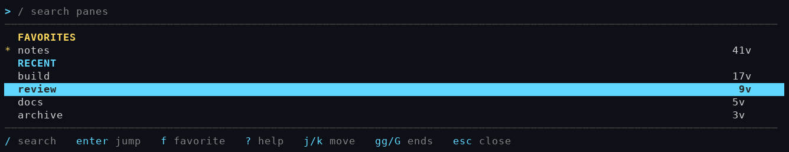
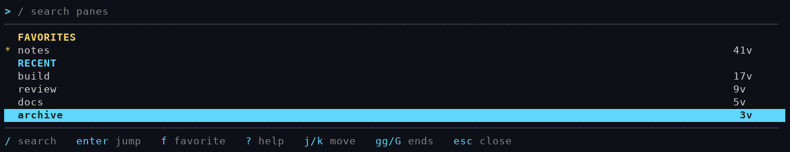
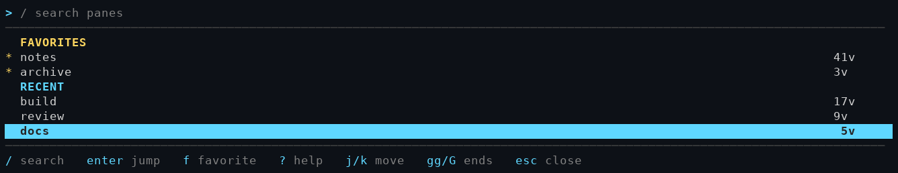
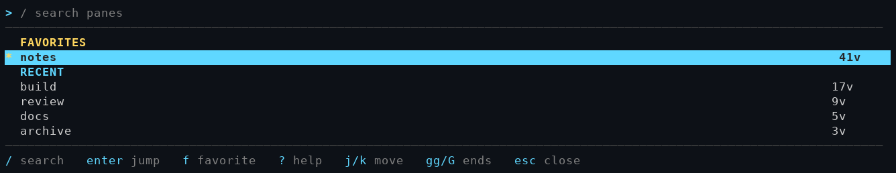
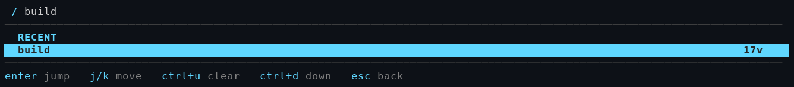

# herdr-recall

A pane recall picker for [Herdr](https://herdr.dev). It remembers which panes
you actually use and lets you jump back to any of them from one overlay list.

Press `prefix+shift+l` and a picker opens as a popup. All and Favorites
are the built-in tabs. Recent and Most used start as tabs you can delete
with `x` (it asks you to confirm) and recreate with `n`. Press `e` to edit a custom tab. The form shows every choice.
`j` and `k` move between fields. `h` and `l` change the highlighted choice. `s` sorts only on All and Favorites.
Recent shows when you last opened the pane. Most used shows how many times.

## Keys

| Key | Action |
| --- | ------ |
| `prefix+shift+l` | open the picker |
| left / right | switch Recent, Most used, Favorites, and All |
| `s` | cycle sort: last used, times opened, name |
| `/` or a letter | search. The typed text shows in the search line |
| `enter` | jump to the selected pane |
| `f` | pin or unpin the selected row. Pinned rows stay at the top |
| `j` / `k` | move one row. The list scrolls one row |
| `esc` | leave search, then close the picker |

The footer shows the keys for the mode you are in: key names in accent,
hint words dim, the same way `prefix+k` does. Status appears as a coloured
dot plus a coloured word (red blocked, yellow working, teal done, green
idle), section headers are coloured, and the favourite star is yellow.

## Screenshots

Favorites view:


Recency view:



Most used view:



After pressing `f` on a row:



Browse mode (footer shows `/ search`); the four status colours show in the
same frame (red blocked, yellow working, teal done, green idle):



Search mode after pressing `/` with a typed query:



The picker draws to the width of the pane it opens in, measured from its own
tty, so a row never wraps even in a narrow overlay.

## Install

Needs Go 1.26+ and Herdr 0.8.0 or newer.

```sh
git clone https://github.com/RooseveltAdvisors/herdr-recall
cd herdr-recall
./install_plugin.sh        # builds bin/herdr-recall and links the plugin
```

Then bind it in `~/.config/herdr/config.toml`:

```toml
[[keys.command]]
key = "prefix+shift+l"
type = "plugin_action"
command = "RooseveltAdvisors.herdr-recall.open-picker"
description = "recall picker"
```

and run `herdr server reload-config`.

## Where state lives

`herdr plugin config-dir RooseveltAdvisors.herdr-recall` prints the directory;
the state file is `recall.json` inside it. It records, per pane: visit count,
last-seen time, and the label shown in the list, plus the favorites list.
Old non-favorite entries are pruned past 200 panes.

## How jumping works

Enter runs `herdr workspace focus` and `herdr tab focus` for the target pane,
then walks `herdr pane focus` hops (choosing the direction from the geometry
in `herdr api snapshot`) until the target pane is the focused pane.

## Companion CLI

- `herdr-recall stats` - print the current state JSON
- `herdr-recall record` - record the focused pane now
- `herdr-recall jump <pane-id>` - jump without the picker
- `herdr-recall favorite <pane-id>` - toggle a favorite
- `herdr-recall render` - print one picker frame (honours `RECALL_QUERY`,
  `RECALL_SEL`, `RECALL_W`, `RECALL_H`, `RECALL_STATUS`); used for tests and
  screenshots
